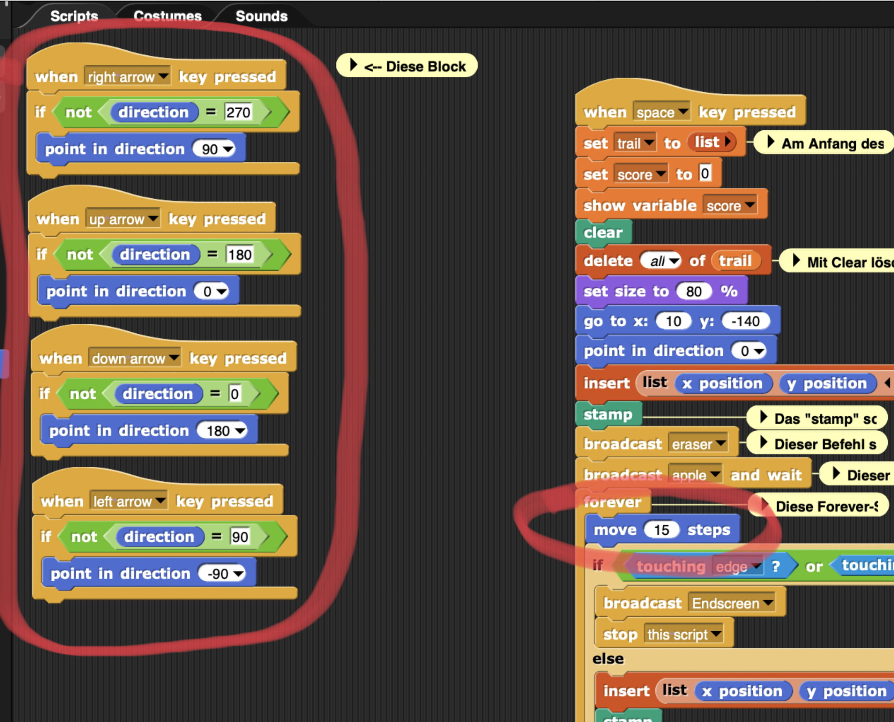

Inhaltsverzeichnis :
Spielprinzip
Snap!
Programmierung

Spielprinzip
Unser Spiel Snapple ist ein Snakespiel. Das Ziel des Spiels ist es hierbei, eine möglichst lange Schlange zu werden und somit einen möglichst hohen Score zu erreichen. Um dies zu erreichen, muss unsere Schlange Äpfel einsammeln, welche bei unserem Spiel das Gesicht einer fiktiven Apfelfigur aus einem etwas älteren Youtube-Video haben. Die Schlange darf hierbei nicht sich selbst oder den Rand des Spielfeldes berühren. Falls dies doch passieren sollte, wird der Score wieder auf 0 gesetzt und man muss von vorne anfangen. Um unser Spiel etwas zeitgerechter zu gestalten, haben wir uns dafür entschieden, aktuelle Meme-Figuren mit in unser Projekt einzubauen. So haben wir zum Beispiel im Startscreen und im Endscreen ein Pepe-Emote eingebaut, welcher seinen Ursprung auf der Gaminglivestream-Plattform Twitch hat. Diese gibt es in verschiedensten Stilen, um sich mit anderen Menschen auch ohne Wörter verständigen zu können.

Snap!
Snap! ist eine auf kindertaugliche Programmiersprachen aufbauende erziehungsorientierte Programmiersprache. Sie ist für fortgeschrittenere Schüler und auch für durchaus erfahrene Erwachsene geeignet. Sie wurde von der Universität Berkley 2011 veröffentlicht. Zu den Entwicklern gehören Jens Möning und Brian Harvey. Snap! ist kompatibel mit Windows, macOS und Linux. Die Programmiersprache ist in 20 verschiedene Sprachen übersetzt und frei im Browser verfügbar.

Programmierung

Grundbewegung

Die linken Blöcke geben die Richtung mithilfe der Pfeiltasten an, in der sich die Schlange bewegen soll. Zudem geben wir mit den "if not"- Befehlen an, dass sich die Schlange auf der Stelle nicht um 180° drehen und somit in sich selbst reinbewegen kann.
Der "move 15 steps"-Befehl in dem rechten großen Block gibt an, dass sobald [space] gedrückt wurde und das Spiel somit gestartet wurde die Schlange sich zu jeder Zeit um 15 Schritte bewegt.

